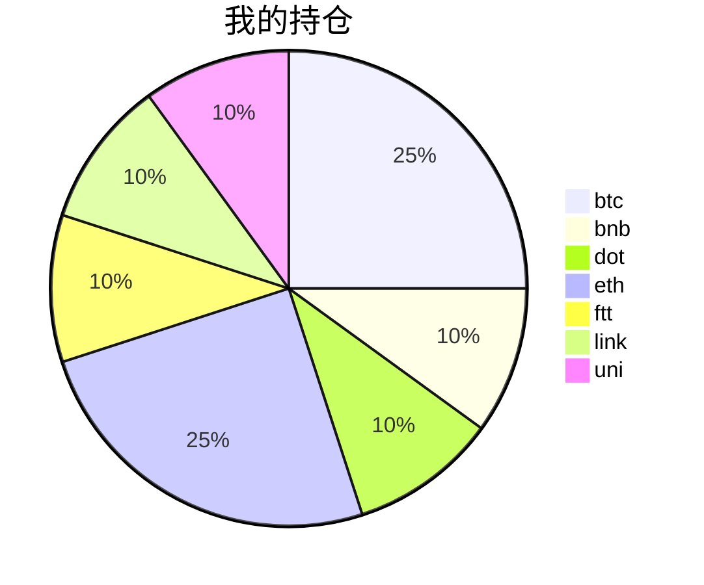

##  📊 今日行情
### 截止 **2021-08-21 00:23:55**
- 🍖 全球加密市场总市值为： **2099373330217** USDT，24h内变化： **7.65%**

- 🍤 24h总交易量为： **113661280175** USDT，24h内变化： **7.65%**

## 🎨 我的持仓占比

## 📋 我的定投策略
📎 我的定投策略制定于 **2021-08-19**，今天是我开始定投的第 **2** 天

由于我在币圈总是被割韭菜，深知自己XJB投资的策略有很大问题，在这个24小时不停盘的d场，我自认为抵制不住人性的贪婪和恐惧；我摊牌了，不装了，我认怂。
所以我制定了自己的定投策略，看策略就知道我这个定投计划还是非常非常保守的。我将以月为单位，每月定投 <strong> 400 </strong> USDT(根据行情不同可能有波动，各项波动不超过50%)，一年内暂不考虑卖出。看看一年后会有什么样的市场行情。

- 🥇 当月市值最高的币种 100USDT
- 🥈 当月市值第2高的币种 100USDT
- 🥉 当月市值前20选4个币种，合计 160USDT
- 🏅 (可选，不选这个就投1个第3项的币种)感兴趣(被CX)或者社区治理优秀(SB多)的1～2个币种，合计40USDT

## ⏰ 24小时收益情况
📌 过去的24小时我的持仓总收益为：**33.11000247** USDT

👉 每个币种的详细数据如下：
<table>
    <thead><tr bgcolor="#d0d0d0" ><th>币种</th><th>排名</th><th>市值(USDT)</th><th>24h交易量(USDT)</th><th>24h%</th><th>7d%</th><th>24h收益</th></tr></thead>
    <tbody>
    <tr>
        <td bgcolor=#F0FFF0>btc</td>
        <td bgcolor=#F0FFF0>1</td>
        <td bgcolor=#F0FFF0>919552625517</td>
        <td bgcolor=#F0FFF0>35249264193</td>
        <td bgcolor=#F0FFF0>6.94%</td>
        <td bgcolor=#F0FFF0>5.61%</td>
        <td bgcolor=#F0FFF0><strong>6.94189446</strong></td>
    </tr>
    <tr>
        <td bgcolor=#F0FFF0>bnb</td>
        <td bgcolor=#F0FFF0>4</td>
        <td bgcolor=#F0FFF0>76004516777</td>
        <td bgcolor=#F0FFF0>2439185932</td>
        <td bgcolor=#F0FFF0>7.10%</td>
        <td bgcolor=#F0FFF0>14.43%</td>
        <td bgcolor=#F0FFF0><strong>2.85729193</strong></td>
    </tr>
    <tr>
        <td bgcolor=#F0FFF0>dot</td>
        <td bgcolor=#F0FFF0>8</td>
        <td bgcolor=#F0FFF0>27644556680</td>
        <td bgcolor=#F0FFF0>2522690737</td>
        <td bgcolor=#F0FFF0>10.01%</td>
        <td bgcolor=#F0FFF0>29.66%</td>
        <td bgcolor=#F0FFF0><strong>3.97014147</strong></td>
    </tr>
    <tr>
        <td bgcolor=#F0FFF0>eth</td>
        <td bgcolor=#F0FFF0>2</td>
        <td bgcolor=#F0FFF0>385501909089</td>
        <td bgcolor=#F0FFF0>19719765856</td>
        <td bgcolor=#F0FFF0>7.41%</td>
        <td bgcolor=#F0FFF0>2.52%</td>
        <td bgcolor=#F0FFF0><strong>7.45810615</strong></td>
    </tr>
    <tr>
        <td bgcolor=#F0FFF0>ftt</td>
        <td bgcolor=#F0FFF0>31</td>
        <td bgcolor=#F0FFF0>5030431550</td>
        <td bgcolor=#F0FFF0>331258849</td>
        <td bgcolor=#F0FFF0>12.05%</td>
        <td bgcolor=#F0FFF0>0.33%</td>
        <td bgcolor=#F0FFF0><strong>4.81626831</strong></td>
    </tr>
    <tr>
        <td bgcolor=#F0FFF0>link</td>
        <td bgcolor=#F0FFF0>12</td>
        <td bgcolor=#F0FFF0>12920498596</td>
        <td bgcolor=#F0FFF0>1812035575</td>
        <td bgcolor=#F0FFF0>10.29%</td>
        <td bgcolor=#F0FFF0>10.31%</td>
        <td bgcolor=#F0FFF0><strong>4.11066</strong></td>
    </tr>
    <tr>
        <td bgcolor=#F0FFF0>uni</td>
        <td bgcolor=#F0FFF0>11</td>
        <td bgcolor=#F0FFF0>17046460988</td>
        <td bgcolor=#F0FFF0>471972825</td>
        <td bgcolor=#F0FFF0>7.30%</td>
        <td bgcolor=#F0FFF0>-1.35%</td>
        <td bgcolor=#F0FFF0><strong>2.95564015</strong></td>
    </tr>
    </tbody>
</table>

## 🎯 持仓整体收益数据

🔒 我的持仓总成本为：**400** USDT，截止 **2021-08-21 00:23:55**，总价值为：**434.0507552** USDT

💰 利润： **34.0507552** USDT，收益率：**8.51%**

👉 每个币种的详细收益数据如下：

<table>
    <thead><tr bgcolor="#d0d0d0" ><th>币种</th><th>持有数量(个)</th><th>现价(USDT)</th><th>总金额(USDT)</th><th>持仓均价(USDT)</th><th>成本(USDT)</th><th>利润(USDT)</th><th>收益率</th></tr></thead>
    <tbody>
    <tr>
        <td bgcolor=#F0FFF0>btc</td>
        <td bgcolor=#F0FFF0>0.002185</td>
        <td bgcolor=#F0FFF0>48933.32653168</td>
        <td bgcolor=#F0FFF0>106.91931847</td>
        <td bgcolor=#F0FFF0>45766.59038902</td>
        <td bgcolor=#F0FFF0>100</td>
        <td bgcolor=#F0FFF0>6.91931847</td>
        <td bgcolor=#F0FFF0><strong>6.92%</strong></td>
    </tr>
    <tr>
        <td bgcolor=#F0FFF0>bnb</td>
        <td bgcolor=#F0FFF0>0.095403</td>
        <td bgcolor=#F0FFF0>452.03911396</td>
        <td bgcolor=#F0FFF0>43.12588759</td>
        <td bgcolor=#F0FFF0>419.27402702</td>
        <td bgcolor=#F0FFF0>40</td>
        <td bgcolor=#F0FFF0>3.12588759</td>
        <td bgcolor=#F0FFF0><strong>7.81%</strong></td>
    </tr>
    <tr>
        <td bgcolor=#F0FFF0>dot</td>
        <td bgcolor=#F0FFF0>1.559096</td>
        <td bgcolor=#F0FFF0>27.99223947</td>
        <td bgcolor=#F0FFF0>43.64258859</td>
        <td bgcolor=#F0FFF0>25.6558929</td>
        <td bgcolor=#F0FFF0>40</td>
        <td bgcolor=#F0FFF0>3.64258859</td>
        <td bgcolor=#F0FFF0><strong>9.11%</strong></td>
    </tr>
    <tr>
        <td bgcolor=#F0FFF0>eth</td>
        <td bgcolor=#F0FFF0>0.032844</td>
        <td bgcolor=#F0FFF0>3289.69444704</td>
        <td bgcolor=#F0FFF0>108.04672442</td>
        <td bgcolor=#F0FFF0>3044.69613933</td>
        <td bgcolor=#F0FFF0>100</td>
        <td bgcolor=#F0FFF0>8.04672442</td>
        <td bgcolor=#F0FFF0><strong>8.05%</strong></td>
    </tr>
    <tr>
        <td bgcolor=#F0FFF0>ftt</td>
        <td bgcolor=#F0FFF0>0.840243</td>
        <td bgcolor=#F0FFF0>53.31842893</td>
        <td bgcolor=#F0FFF0>44.80043668</td>
        <td bgcolor=#F0FFF0>47.60527609</td>
        <td bgcolor=#F0FFF0>40</td>
        <td bgcolor=#F0FFF0>4.80043668</td>
        <td bgcolor=#F0FFF0><strong>12.00%</strong></td>
    </tr>
    <tr>
        <td bgcolor=#F0FFF0>link</td>
        <td bgcolor=#F0FFF0>1.526624</td>
        <td bgcolor=#F0FFF0>28.87200616</td>
        <td bgcolor=#F0FFF0>44.07669753</td>
        <td bgcolor=#F0FFF0>26.20160563</td>
        <td bgcolor=#F0FFF0>40</td>
        <td bgcolor=#F0FFF0>4.07669753</td>
        <td bgcolor=#F0FFF0><strong>10.19%</strong></td>
    </tr>
    <tr>
        <td bgcolor=#F0FFF0>uni</td>
        <td bgcolor=#F0FFF0>1.497</td>
        <td bgcolor=#F0FFF0>29.01743615</td>
        <td bgcolor=#F0FFF0>43.43910192</td>
        <td bgcolor=#F0FFF0>26.72010688</td>
        <td bgcolor=#F0FFF0>40</td>
        <td bgcolor=#F0FFF0>3.43910192</td>
        <td bgcolor=#F0FFF0><strong>8.60%</strong></td>
    </tr>
    </tbody>
</table>

## ⚠️ 风险友情提示
❤️ 本篇文章仅作为个人投资记录使用，区块链投资风险巨大，请管好你自己的钱袋子呦～ ❤️