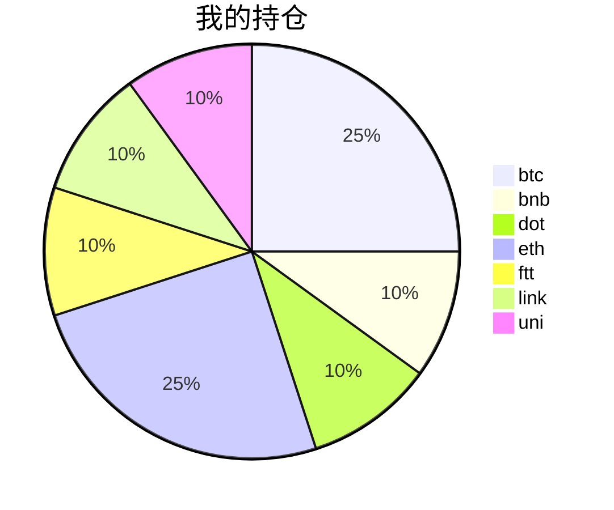

{
  "title":"2021-08-21 数字货币定投日记,收益率：8.45%",
  "tags":[
    "投资",
    "虚拟币"
  ],
  "date":"2021-08-21",
  "lastmod":"2021-08-21",
  "draft":"false",
  "author":"kingram"
}

##  📊 今日行情
### 截止 **2021-08-21 15:29:50**
- 🍖 全球加密市场总市值为： **2101755608148** USDT，24h内变化： **3.10%**

- 🍤 24h总交易量为： **111762157749** USDT，24h内变化： **3.10%**

## 🎨 我的持仓占比

## 📋 我的定投策略
📎 我的定投策略制定于 **2021-08-19**，今天是我开始定投的第 **2** 天

由于我在币圈总是被割韭菜，深知自己XJB投资的策略有很大问题，在这个24小时不停盘的d场，我自认为抵制不住人性的贪婪和恐惧；我摊牌了，不装了，我认怂。
所以我制定了自己的定投策略，看策略就知道我这个定投计划还是非常非常保守的。我将以月为单位，每月定投 <strong> 400 </strong> USDT(根据行情不同可能有波动，各项波动不超过50%)，一年内暂不考虑卖出。看看一年后会有什么样的市场行情。

- 🥇 当月市值最高的币种 100USDT
- 🥈 当月市值第2高的币种 100USDT
- 🥉 当月市值前20选4个币种，合计 160USDT
- 🏅 (可选，不选这个就投1个第3项的币种)感兴趣(被CX)或者社区治理优秀(SB多)的1～2个币种，合计40USDT

## ⏰ 24小时收益情况
📌 过去的24小时我的持仓总收益为：**17.24395709** USDT

👉 每个币种的详细数据如下：
<table>
    <thead><tr bgcolor="#d0d0d0" ><th>币种</th><th>排名</th><th>市值(USDT)</th><th>24h交易量(USDT)</th><th>24h%</th><th>7d%</th><th>24h收益</th></tr></thead>
    <tbody>
    <tr>
        <td bgcolor=#F0FFF0>btc</td>
        <td bgcolor=#F0FFF0>1</td>
        <td bgcolor=#F0FFF0>919052433737</td>
        <td bgcolor=#F0FFF0>38189389998</td>
        <td bgcolor=#F0FFF0>3.95%</td>
        <td bgcolor=#F0FFF0>2.54%</td>
        <td bgcolor=#F0FFF0><strong>4.0567011</strong></td>
    </tr>
    <tr>
        <td bgcolor=#F0FFF0>bnb</td>
        <td bgcolor=#F0FFF0>4</td>
        <td bgcolor=#F0FFF0>76782073187</td>
        <td bgcolor=#F0FFF0>2496885039</td>
        <td bgcolor=#F0FFF0>6.86%</td>
        <td bgcolor=#F0FFF0>9.50%</td>
        <td bgcolor=#F0FFF0><strong>2.79765083</strong></td>
    </tr>
    <tr>
        <td bgcolor=#F0FFF0>dot</td>
        <td bgcolor=#F0FFF0>8</td>
        <td bgcolor=#F0FFF0>28562067602</td>
        <td bgcolor=#F0FFF0>2538862711</td>
        <td bgcolor=#F0FFF0>8.37%</td>
        <td bgcolor=#F0FFF0>25.96%</td>
        <td bgcolor=#F0FFF0><strong>3.48261227</strong></td>
    </tr>
    <tr>
        <td bgcolor=#F0FFF0>eth</td>
        <td bgcolor=#F0FFF0>2</td>
        <td bgcolor=#F0FFF0>385197963065</td>
        <td bgcolor=#F0FFF0>21009625542</td>
        <td bgcolor=#F0FFF0>2.02%</td>
        <td bgcolor=#F0FFF0>-0.98%</td>
        <td bgcolor=#F0FFF0><strong>2.1345665</strong></td>
    </tr>
    <tr>
        <td bgcolor=#F0FFF0>ftt</td>
        <td bgcolor=#F0FFF0>33</td>
        <td bgcolor=#F0FFF0>4758433599</td>
        <td bgcolor=#F0FFF0>820049137</td>
        <td bgcolor=#F0FFF0>0.44%</td>
        <td bgcolor=#F0FFF0>0.04%</td>
        <td bgcolor=#F0FFF0><strong>0.18628369</strong></td>
    </tr>
    <tr>
        <td bgcolor=#F0FFF0>link</td>
        <td bgcolor=#F0FFF0>13</td>
        <td bgcolor=#F0FFF0>12899695856</td>
        <td bgcolor=#F0FFF0>1667341922</td>
        <td bgcolor=#F0FFF0>5.85%</td>
        <td bgcolor=#F0FFF0>3.56%</td>
        <td bgcolor=#F0FFF0><strong>2.43145867</strong></td>
    </tr>
    <tr>
        <td bgcolor=#F0FFF0>uni</td>
        <td bgcolor=#F0FFF0>11</td>
        <td bgcolor=#F0FFF0>17242259884</td>
        <td bgcolor=#F0FFF0>446857043</td>
        <td bgcolor=#F0FFF0>5.16%</td>
        <td bgcolor=#F0FFF0>-3.28%</td>
        <td bgcolor=#F0FFF0><strong>2.15468403</strong></td>
    </tr>
    </tbody>
</table>

## 🎯 持仓整体收益数据

🔒 我的持仓总成本为：**400** USDT，截止 **2021-08-21 15:29:50**，总价值为：**433.79191867** USDT

💰 利润： **33.79191867** USDT，收益率：**8.45%**

👉 每个币种的详细收益数据如下：

<table>
    <thead><tr bgcolor="#d0d0d0" ><th>币种</th><th>持有数量(个)</th><th>现价(USDT)</th><th>总金额(USDT)</th><th>持仓均价(USDT)</th><th>成本(USDT)</th><th>利润(USDT)</th><th>收益率</th></tr></thead>
    <tbody>
    <tr>
        <td bgcolor=#F0FFF0>btc</td>
        <td bgcolor=#F0FFF0>0.002185</td>
        <td bgcolor=#F0FFF0>48905.29605288</td>
        <td bgcolor=#F0FFF0>106.85807188</td>
        <td bgcolor=#F0FFF0>45766.59038902</td>
        <td bgcolor=#F0FFF0>100</td>
        <td bgcolor=#F0FFF0>6.85807188</td>
        <td bgcolor=#F0FFF0><strong>6.86%</strong></td>
    </tr>
    <tr>
        <td bgcolor=#F0FFF0>bnb</td>
        <td bgcolor=#F0FFF0>0.095403</td>
        <td bgcolor=#F0FFF0>456.66365373</td>
        <td bgcolor=#F0FFF0>43.56708256</td>
        <td bgcolor=#F0FFF0>419.27402702</td>
        <td bgcolor=#F0FFF0>40</td>
        <td bgcolor=#F0FFF0>3.56708256</td>
        <td bgcolor=#F0FFF0><strong>8.92%</strong></td>
    </tr>
    <tr>
        <td bgcolor=#F0FFF0>dot</td>
        <td bgcolor=#F0FFF0>1.559096</td>
        <td bgcolor=#F0FFF0>28.92128983</td>
        <td bgcolor=#F0FFF0>45.09106729</td>
        <td bgcolor=#F0FFF0>25.6558929</td>
        <td bgcolor=#F0FFF0>40</td>
        <td bgcolor=#F0FFF0>5.09106729</td>
        <td bgcolor=#F0FFF0><strong>12.73%</strong></td>
    </tr>
    <tr>
        <td bgcolor=#F0FFF0>eth</td>
        <td bgcolor=#F0FFF0>0.032844</td>
        <td bgcolor=#F0FFF0>3286.8751786</td>
        <td bgcolor=#F0FFF0>107.95412837</td>
        <td bgcolor=#F0FFF0>3044.69613933</td>
        <td bgcolor=#F0FFF0>100</td>
        <td bgcolor=#F0FFF0>7.95412837</td>
        <td bgcolor=#F0FFF0><strong>7.95%</strong></td>
    </tr>
    <tr>
        <td bgcolor=#F0FFF0>ftt</td>
        <td bgcolor=#F0FFF0>0.840243</td>
        <td bgcolor=#F0FFF0>50.43547481</td>
        <td bgcolor=#F0FFF0>42.37805466</td>
        <td bgcolor=#F0FFF0>47.60527609</td>
        <td bgcolor=#F0FFF0>40</td>
        <td bgcolor=#F0FFF0>2.37805466</td>
        <td bgcolor=#F0FFF0><strong>5.95%</strong></td>
    </tr>
    <tr>
        <td bgcolor=#F0FFF0>link</td>
        <td bgcolor=#F0FFF0>1.526624</td>
        <td bgcolor=#F0FFF0>28.82552058</td>
        <td bgcolor=#F0FFF0>44.00573153</td>
        <td bgcolor=#F0FFF0>26.20160563</td>
        <td bgcolor=#F0FFF0>40</td>
        <td bgcolor=#F0FFF0>4.00573153</td>
        <td bgcolor=#F0FFF0><strong>10.01%</strong></td>
    </tr>
    <tr>
        <td bgcolor=#F0FFF0>uni</td>
        <td bgcolor=#F0FFF0>1.497</td>
        <td bgcolor=#F0FFF0>29.35055603</td>
        <td bgcolor=#F0FFF0>43.93778238</td>
        <td bgcolor=#F0FFF0>26.72010688</td>
        <td bgcolor=#F0FFF0>40</td>
        <td bgcolor=#F0FFF0>3.93778238</td>
        <td bgcolor=#F0FFF0><strong>9.84%</strong></td>
    </tr>
    </tbody>
</table>

## ⚠️ 风险友情提示
❤️ 本篇文章仅作为个人投资记录使用，区块链投资风险巨大，请管好你自己的钱袋子呦～ ❤️