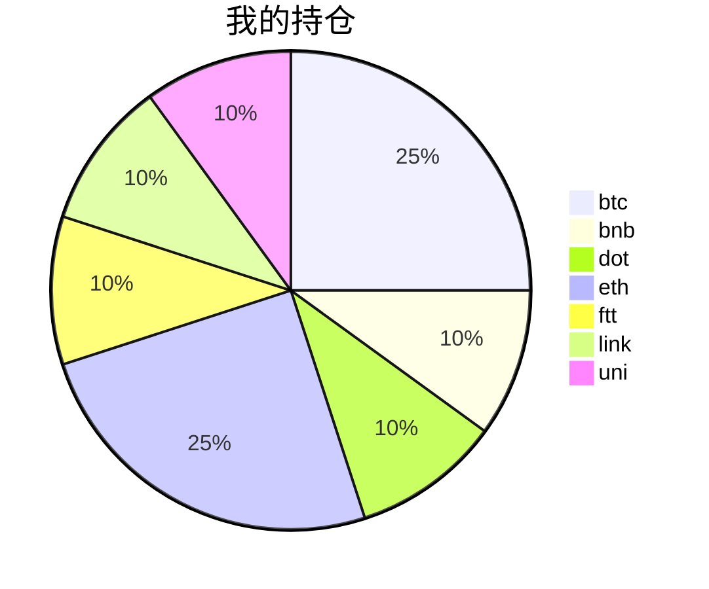

{
  "title":"2021-08-22 数字货币定投日记，收益率：-100.00%",
  "tags":[
    "投资",
    "虚拟币"
  ],
  "date":"2021-08-22",
  "lastmod":"2021-08-22",
  "draft":"false",
  "author":"kingram"
}

##  📊 今日行情
### 截止 **2021-08-22 11:18:12**
- 🍖 全球加密市场总市值为： **0** USDT，24h内变化： **0.00%**

- 🍤 24h总交易量为： **0** USDT，24h内变化： **0.00%**

## 🎨 我的持仓占比

## 📋 我的定投策略
📎 我的定投策略制定于 **2021-08-19**，今天是我开始定投的第 **3** 天

由于我在币圈总是被割韭菜，深知自己XJB投资的策略有很大问题，在这个24小时不停盘的d场，我自认为抵制不住人性的贪婪和恐惧；我摊牌了，不装了，我认怂。
所以我制定了自己的定投策略，看策略就知道我这个定投计划还是非常非常保守的。我将以月为单位，每月定投 <strong> 400 </strong> USDT(根据行情不同可能有波动，各项波动不超过50%)，一年内暂不考虑卖出。看看一年后会有什么样的市场行情。

- 🥇 当月市值最高的币种 100USDT
- 🥈 当月市值第2高的币种 100USDT
- 🥉 当月市值前20选4个币种，合计 160USDT
- 🏅 (可选，不选这个就投1个第3项的币种)感兴趣(被CX)或者社区治理优秀(SB多)的1～2个币种，合计40USDT

## ⏰ 24小时收益情况
📌 过去的24小时我的持仓总收益为：**0** USDT

👉 每个币种的详细数据如下：
<table>
    <thead><tr bgcolor="#d0d0d0" ><th>币种</th><th>排名</th><th>市值(USDT)</th><th>24h交易量(USDT)</th><th>24h%</th><th>7d%</th><th>24h收益</th></tr></thead>
    <tbody>
    <tr>
        <td bgcolor=#FFECEC>btc</td>
        <td bgcolor=#FFECEC>0</td>
        <td bgcolor=#FFECEC>0</td>
        <td bgcolor=#FFECEC>0</td>
        <td bgcolor=#FFECEC>0.00%</td>
        <td bgcolor=#FFECEC>0.00%</td>
        <td bgcolor=#FFECEC><strong>0</strong></td>
    </tr>
    <tr>
        <td bgcolor=#FFECEC>bnb</td>
        <td bgcolor=#FFECEC>0</td>
        <td bgcolor=#FFECEC>0</td>
        <td bgcolor=#FFECEC>0</td>
        <td bgcolor=#FFECEC>0.00%</td>
        <td bgcolor=#FFECEC>0.00%</td>
        <td bgcolor=#FFECEC><strong>0</strong></td>
    </tr>
    <tr>
        <td bgcolor=#FFECEC>dot</td>
        <td bgcolor=#FFECEC>0</td>
        <td bgcolor=#FFECEC>0</td>
        <td bgcolor=#FFECEC>0</td>
        <td bgcolor=#FFECEC>0.00%</td>
        <td bgcolor=#FFECEC>0.00%</td>
        <td bgcolor=#FFECEC><strong>0</strong></td>
    </tr>
    <tr>
        <td bgcolor=#FFECEC>eth</td>
        <td bgcolor=#FFECEC>0</td>
        <td bgcolor=#FFECEC>0</td>
        <td bgcolor=#FFECEC>0</td>
        <td bgcolor=#FFECEC>0.00%</td>
        <td bgcolor=#FFECEC>0.00%</td>
        <td bgcolor=#FFECEC><strong>0</strong></td>
    </tr>
    <tr>
        <td bgcolor=#FFECEC>ftt</td>
        <td bgcolor=#FFECEC>0</td>
        <td bgcolor=#FFECEC>0</td>
        <td bgcolor=#FFECEC>0</td>
        <td bgcolor=#FFECEC>0.00%</td>
        <td bgcolor=#FFECEC>0.00%</td>
        <td bgcolor=#FFECEC><strong>0</strong></td>
    </tr>
    <tr>
        <td bgcolor=#FFECEC>link</td>
        <td bgcolor=#FFECEC>0</td>
        <td bgcolor=#FFECEC>0</td>
        <td bgcolor=#FFECEC>0</td>
        <td bgcolor=#FFECEC>0.00%</td>
        <td bgcolor=#FFECEC>0.00%</td>
        <td bgcolor=#FFECEC><strong>0</strong></td>
    </tr>
    <tr>
        <td bgcolor=#FFECEC>uni</td>
        <td bgcolor=#FFECEC>0</td>
        <td bgcolor=#FFECEC>0</td>
        <td bgcolor=#FFECEC>0</td>
        <td bgcolor=#FFECEC>0.00%</td>
        <td bgcolor=#FFECEC>0.00%</td>
        <td bgcolor=#FFECEC><strong>0</strong></td>
    </tr>
    </tbody>
</table>

## 🎯 持仓整体收益数据

🔒 我的持仓总成本为：**400** USDT，截止 **2021-08-22 11:18:12**，总价值为：**0** USDT

💰 利润： **-400** USDT，收益率：**-100.00%**

👉 每个币种的详细收益数据如下：

<table>
    <thead><tr bgcolor="#d0d0d0" ><th>币种</th><th>持有数量(个)</th><th>现价(USDT)</th><th>总金额(USDT)</th><th>持仓均价(USDT)</th><th>成本(USDT)</th><th>利润(USDT)</th><th>收益率</th></tr></thead>
    <tbody>
    <tr>
        <td bgcolor=#FFECEC>btc</td>
        <td bgcolor=#FFECEC>0.002185</td>
        <td bgcolor=#FFECEC>0</td>
        <td bgcolor=#FFECEC>0</td>
        <td bgcolor=#FFECEC>45766.59038902</td>
        <td bgcolor=#FFECEC>100</td>
        <td bgcolor=#FFECEC>-100</td>
        <td bgcolor=#FFECEC><strong>-100.00%</strong></td>
    </tr>
    <tr>
        <td bgcolor=#FFECEC>bnb</td>
        <td bgcolor=#FFECEC>0.095403</td>
        <td bgcolor=#FFECEC>0</td>
        <td bgcolor=#FFECEC>0</td>
        <td bgcolor=#FFECEC>419.27402702</td>
        <td bgcolor=#FFECEC>40</td>
        <td bgcolor=#FFECEC>-40</td>
        <td bgcolor=#FFECEC><strong>-100.00%</strong></td>
    </tr>
    <tr>
        <td bgcolor=#FFECEC>dot</td>
        <td bgcolor=#FFECEC>1.559096</td>
        <td bgcolor=#FFECEC>0</td>
        <td bgcolor=#FFECEC>0</td>
        <td bgcolor=#FFECEC>25.6558929</td>
        <td bgcolor=#FFECEC>40</td>
        <td bgcolor=#FFECEC>-40</td>
        <td bgcolor=#FFECEC><strong>-100.00%</strong></td>
    </tr>
    <tr>
        <td bgcolor=#FFECEC>eth</td>
        <td bgcolor=#FFECEC>0.032844</td>
        <td bgcolor=#FFECEC>0</td>
        <td bgcolor=#FFECEC>0</td>
        <td bgcolor=#FFECEC>3044.69613933</td>
        <td bgcolor=#FFECEC>100</td>
        <td bgcolor=#FFECEC>-100</td>
        <td bgcolor=#FFECEC><strong>-100.00%</strong></td>
    </tr>
    <tr>
        <td bgcolor=#FFECEC>ftt</td>
        <td bgcolor=#FFECEC>0.840243</td>
        <td bgcolor=#FFECEC>0</td>
        <td bgcolor=#FFECEC>0</td>
        <td bgcolor=#FFECEC>47.60527609</td>
        <td bgcolor=#FFECEC>40</td>
        <td bgcolor=#FFECEC>-40</td>
        <td bgcolor=#FFECEC><strong>-100.00%</strong></td>
    </tr>
    <tr>
        <td bgcolor=#FFECEC>link</td>
        <td bgcolor=#FFECEC>1.526624</td>
        <td bgcolor=#FFECEC>0</td>
        <td bgcolor=#FFECEC>0</td>
        <td bgcolor=#FFECEC>26.20160563</td>
        <td bgcolor=#FFECEC>40</td>
        <td bgcolor=#FFECEC>-40</td>
        <td bgcolor=#FFECEC><strong>-100.00%</strong></td>
    </tr>
    <tr>
        <td bgcolor=#FFECEC>uni</td>
        <td bgcolor=#FFECEC>1.497</td>
        <td bgcolor=#FFECEC>0</td>
        <td bgcolor=#FFECEC>0</td>
        <td bgcolor=#FFECEC>26.72010688</td>
        <td bgcolor=#FFECEC>40</td>
        <td bgcolor=#FFECEC>-40</td>
        <td bgcolor=#FFECEC><strong>-100.00%</strong></td>
    </tr>
    </tbody>
</table>

## ⚠️ 风险友情提示
❤️ 本篇文章仅作为个人投资记录使用，区块链投资风险巨大，请管好你自己的钱袋子呦～ ❤️